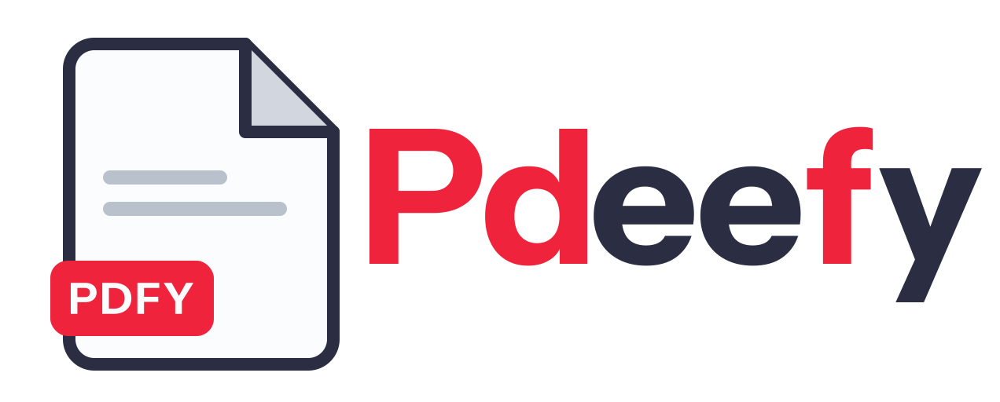
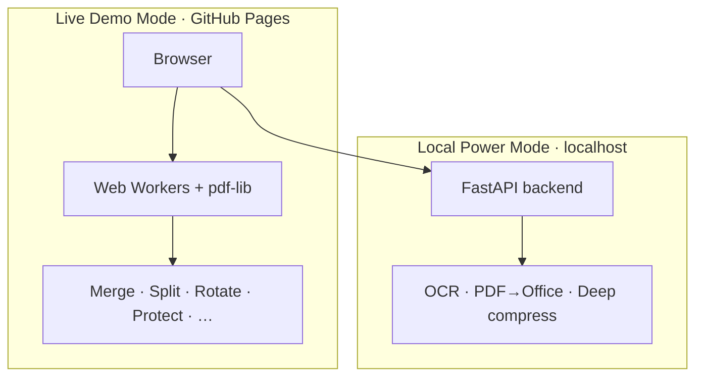

<p align="center">
  <picture>
    <source media="(prefers-color-scheme: dark)" srcset="public/app-logo-dark.svg">
    
  </picture>
</p>

<p align="center">
  <strong>PDF tools that stay in your browser.</strong><br>
  Merge, split, convert, and protect documents — fast, private, and open source.
</p>

<p align="center">
  <a href="https://edvardhov.github.io/pdeefy/"><strong>Try the live demo →</strong></a>
</p>

<p align="center">
  <a href="https://github.com/edvardhov/pdeefy/blob/main/LICENSE"></a>
  <a href="https://github.com/edvardhov/pdeefy/releases"></a>
  <a href="https://edvardhov.github.io/pdeefy/"></a>
  
  
</p>

---

## Why Pdeefy

|                        |                                                                                                                 |
| ---------------------- | --------------------------------------------------------------------------------------------------------------- |
| **Private by default** | Core tools run entirely in the browser via Web Workers — your files never leave your machine in Live Demo Mode. |
| **Dual-mode**          | Use the hosted demo instantly, or connect a local FastAPI backend for OCR, Office export, and deep compression. |
| **Modern stack**       | React 19, TypeScript, Tailwind v4, and `pdf-lib` — built to extend, not to lock you in.                         |

## Dual-mode architecture



| Mode            | Where it runs                                       | Best for                                       |
| --------------- | --------------------------------------------------- | ---------------------------------------------- |
| **Live Demo**   | GitHub Pages, 100% client-side                      | Everyday PDF edits, no install                 |
| **Local Power** | Your machine + [FastAPI backend](backend/README.md) | OCR, DOCX/XLSX export, Ghostscript compression |

## Features

<details open>
<summary><strong>Always available</strong> — no backend, no upload</summary>

<br>

- Merge, split, extract, delete & reorder pages
- Rotate, flatten, fill & sign, add text & images
- Password protect & unlock
- JPG / PNG → PDF, Markdown → PDF
- Watermark _(and more in the registry)_

</details>

<details>
<summary><strong>Local Power Mode</strong> — requires the backend</summary>

<br>

- PDF → Word (DOCX)
- PDF → Excel / PowerPoint
- OCR (Tesseract)
- Deep compress (Ghostscript / PyMuPDF)

</details>

## Quick start

### Docker

Requires [Docker Desktop](https://www.docker.com/products/docker-desktop/) (or Docker Engine + Compose).

```bash
git clone https://github.com/edvardhov/pdeefy.git
cd pdeefy
docker compose up -d
```

Open [http://localhost:5173/](http://localhost:5173/) — frontend and backend (OCR, Office export, deep compression) are ready. The app auto-detects the backend at `http://localhost:8000/api/health`.

Stop the stack:

```bash
docker compose down
```

**Production-style local build** (static frontend via nginx on port 4173, no hot reload):

```bash
docker compose -f docker-compose.yml -f docker-compose.prod.yml up -d --build
```

Open [http://localhost:4173/](http://localhost:4173/)

### Manual setup (without Docker)

#### Frontend (Live Demo locally)

```bash
git clone https://github.com/edvardhov/pdeefy.git
cd pdeefy
npm install
npm run dev
```

Open [http://localhost:5173/](http://localhost:5173/)

#### Backend (Local Power Mode)

```bash
cd backend
python3.11 -m venv .venv
source .venv/bin/activate   # Windows: .venv\Scripts\activate
pip install -r requirements.txt
uvicorn app.main:app --reload --port 8000
```

The app auto-detects the backend at `http://localhost:8000/api/health`. Override the URL in **Settings** if needed.

Full backend setup: [backend/README.md](backend/README.md)

### GitHub Pages + local backend

The [live demo](https://edvardhov.github.io/pdeefy/) runs entirely in the browser for core tools. Run `docker compose up -d` (backend only is enough) to unlock Local Power Mode from the hosted site — the app polls `http://localhost:8000/api/health` from your browser. Works in Chrome, Edge, and Firefox; Safari may block HTTPS → `http://localhost` mixed content.

## Stack

| Layer        | Tech                                                       |
| ------------ | ---------------------------------------------------------- |
| Frontend     | Vite · React 19 · TypeScript · Tailwind CSS v4 · Shadcn/ui |
| PDF (client) | pdf-lib · Web Workers · pdfjs-dist                         |
| Backend      | FastAPI · PyMuPDF · python-docx · pytesseract              |

## Versioning

The app version lives in [`package.json`](package.json) (`0.1.0`). The frontend embeds it at build time; the backend reads the same value from `package.json` (or `APP_VERSION` in Docker).

See [CHANGELOG.md](CHANGELOG.md) for release notes.

### Cut a release

1. Update `version` in `package.json` and add an entry to `CHANGELOG.md`.
2. Commit and push to `main`.
3. Tag and push — this creates a [GitHub Release](https://github.com/edvardhov/pdeefy/releases) via [`.github/workflows/release.yml`](.github/workflows/release.yml):

```bash
git tag v0.1.0
git push origin v0.1.0
```

The tag must match `package.json` exactly (e.g. tag `v0.1.0` ↔ `"version": "0.1.0"`).

## Deploy

Pushes to `main` deploy to GitHub Pages via [`.github/workflows/deploy.yml`](.github/workflows/deploy.yml). Set the repository **Pages** source to **GitHub Actions**.

## Brand assets

Logo SVGs (light / dark icon + wordmark lockups) live in [`public/`](public/). The app uses the full lockup on large screens and the square icon on mobile, swapping with the active theme.

## License

[MIT](LICENSE) · © [Edvard Hovhannisyan](https://github.com/edvardhov)
